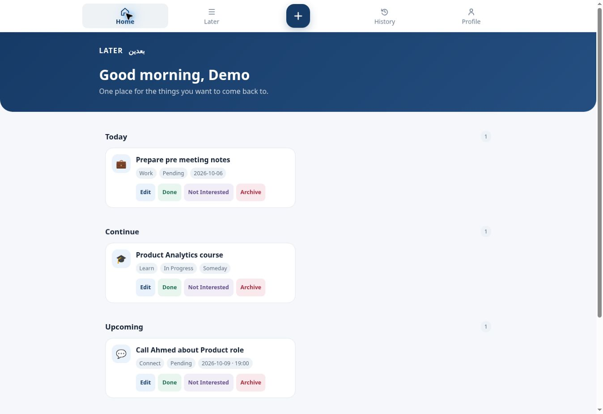
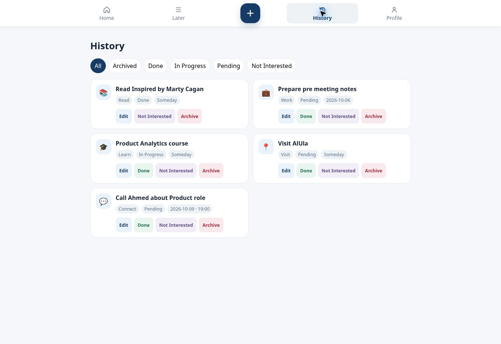

# Later | بعدين

**One place for the things you want to come back to.**

[**Live Demo →**](https://hassansaber1911-dot.github.io/Later-Ba3den/)

## Product Preview

Real screenshots from the live application with its sample items and a test entry.

### Resurface intentions by context

### Keep the outcome and the history

## The problem
Courses, purchases, places and small intentions get scattered across screenshots and notes. They need a home without becoming an overdue task list.

## MVP and user flow
Capture an item → add light context → revisit it in Today, Continue, Upcoming or Someday → progress, complete or dismiss it → review History.

- Quick capture with category, notes and optional date/time or image.
- Pending, In Progress, Done and Not Interested states.
- Home, actionable Later list and filtered History.
- Archive and restore.

## Business rules and product decisions
**Later = Pending + In Progress.** History preserves captured items across outcomes.

**Dates are optional.** A someday intention does not need an invented deadline.

**Not Interested is a valid outcome.** Closing an intention should not require pretending it was completed.

**Capture first.** The MVP collects enough context to return to an item without a heavy planning process.

## Measurement
GA4 events cover capture, editing, completion, dismissal, archive/restore and section views. Titles, notes and images are excluded from analytics parameters. No retention or user-growth results are claimed.

## Validation and current limits
Live flow checked on 6 October 2026: name onboarding, quick-add of an undated reading item, visibility in Later, completion and visibility as Done in History. Data is browser-local. There is no cloud sync, reminder delivery or cross-device access.

---
Built by **Hassan Mohamed Saber** · Product portfolio
